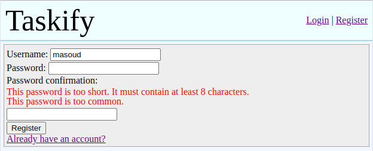
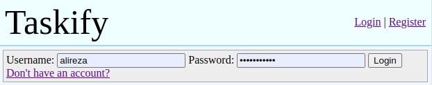
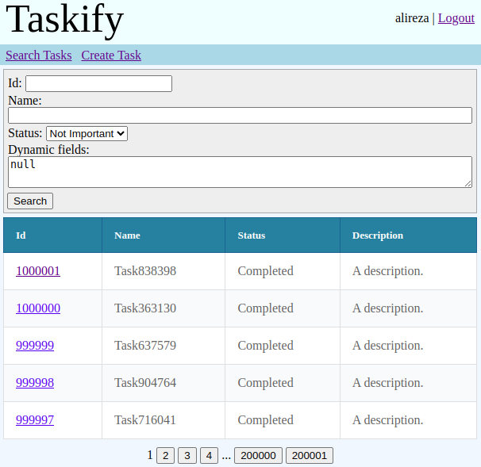
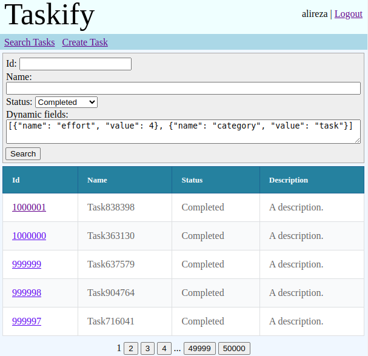
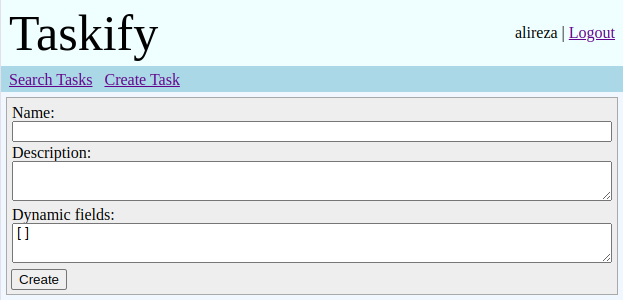
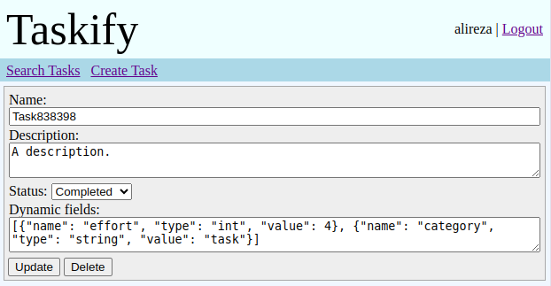
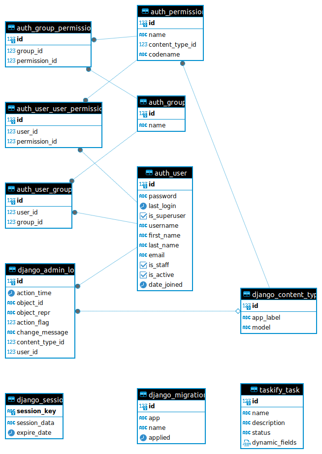

# Taskify
This is a test project aimed at developing a task management system similar to Jira, with a focus on flexibility in defining custom fields for tasks. The primary entity is the 'task,' which comprises static fields such as id, name, description, and status, alongside customizable 'custom-fields' of various types like text, int, date, and links to users.

## Images
Register page:



Login page:



List/search tasks page (over 1 million tasks):

<table>
    <tr>
        <td></td>
        <td></td>
    </tr>
</table>

Create a task page:



Edit (update/delete) an existing task page:



## Database Schema


## Features
- [x] Authentication and authorization: using the built-in Django administration.
  - [x] Registration
  - [x] Login
- [x] Administration
- [x] Task management
  - [x] Definition and validation (format and existence)
    - [x] Id
    - [x] Name
    - [x] Description
    - [x] Dynamic fields
      - [x] Int
      - [x] Text
      - [x] Date
      - [x] User
  - [x] Create
  - [x] Update
  - [x] Delete
  - [x] List/Search
    - [x] Static fields
    - [x] Dynamic fields
    - [x] Pagination
  - [ ] Graphical dynamic fields management

## Installation
You should only clone the repository:

```console
git clone https://github.com/AlirezaRoshanzamir/taskify.git
```

and start the services:

```console
docker compose up
```

## Build Tools and Software Stack
The following programming languages and tools are used in this repository:

- Programming and Scripting Language: [Python](https://www.python.org)
- Web Framework: [Django](https://www.djangoproject.com/)
- Static Analysis and Formatter: [isort](https://pycqa.github.io/isort), [Black](https://black.readthedocs.io/)
- Virtualization and Container Orchestration: [Docker](https://www.docker.com), [Docker Compose](https://docs.docker.com/compose)
- Database: [PostgreSQL](https://www.postgresql.org/)

## Common Commands
You can perform common tasks on the repository as follows:

| Command | Description |
| ------- | ----------- |
| `black . && isort .` | Format the code. |
| `python -m venv venv && source venv/bin/action` | Create a virtual environment and activate it. |
| `pip install -r 3rdparty/requirements.txt` | Install the requirements. |
| `pip install -r 3rdparty/requirements-dev.txt` | Install the development time requirements. |
| `python manage.py makemigrations` | Generate migrations. |
| `python manage.py migrate` | Apply migrations. |
| `python manage.py runserver` | Run the server. |
| `docker compose up` | Build the Docker images and start the services. |
| `docker compose down` | Shut-down the services. |
